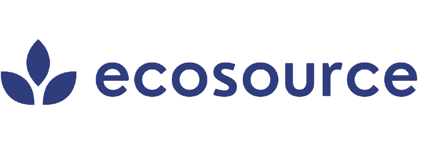

<!-- <h1 align="center">Welcome to Ecosource 👋</h1>

  

  
  
  
  

> Ecosource empowers users to create awareness about climate change. It lets users to share ideas and inspire others to make a difference.

## Author

👤 **Karan Choudhary**

* Github: [@itskaranchoudhary](https://github.com/itskaranchoudhary)

## 🤝 Contributing

Contributions, issues and feature requests are welcome! Feel free to check [issues page](https://github.com/itskaranchoudhary/ecosource/issues). You can also take a look at the [contributing guide](https://github.com/itskaranchoudhary/ecosource/blob/master/CONTRIBUTING.md).

## 👨🏻‍💻 How to get started?

You can refer to the following articles on  **_basics of Git and Github in case you are stuck_**:

-   [Forking a Repo](https://help.github.com/en/github/getting-started-with-github/fork-a-repo)
-   [Cloning a Repo](https://help.github.com/en/desktop/contributing-to-projects/creating-a-pull-request)
-   [How to create a Pull Request](https://opensource.com/article/19/7/create-pull-request-github)
-   [Getting started with Git and GitHub](https://towardsdatascience.com/getting-started-with-git-and-github-6fcd0f2d4ac6)

## 🦄 Deploy

<a href="https://cloud.digitalocean.com/apps/new?repo=https://github.com/itskaranchoudhary/ecosource">

Copyright © 2022 Karan Choudhary   -->
